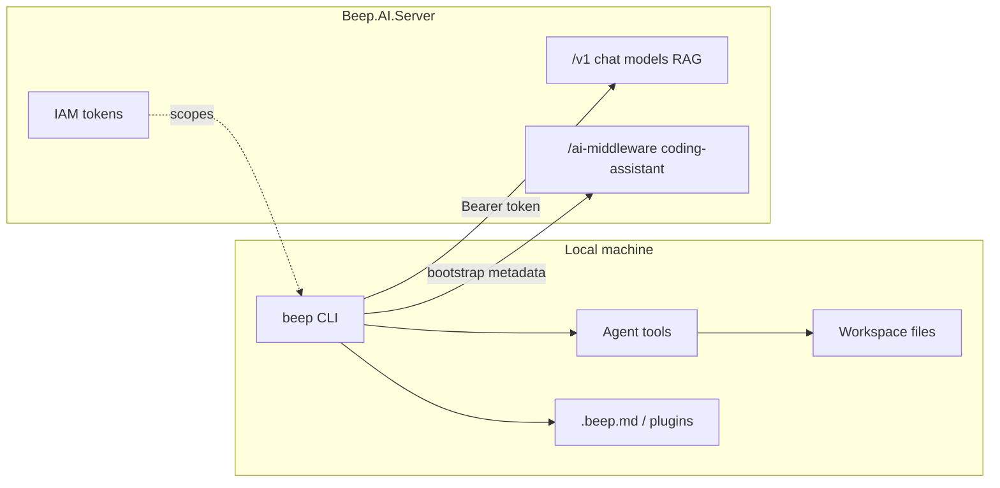

# Beep.AI.Code — Application Overview

## Purpose

Beep.AI.Code is a **Python CLI** that provides a terminal-native coding assistant experience against a self-hosted **[Beep.AI.Server](https://github.com/The-Tech-Idea/Beep.AI.Server)** instance. It is not a standalone LLM runtime: models, RAG corpora, IAM, and Coding Assistant policies live on the server.

Typical comparisons:

| Product pattern | Beep.AI.Code equivalent |
|-----------------|-------------------------|
| Codex CLI → OpenAI API | `beep` → `/v1/*` on your server |
| Claude Code → Anthropic | Same, with optional Coding Assistant metadata |
| IDE agent + MCP | `beep agent` + optional MCP bridge (`BEEP_MCP`) |

## High-level architecture

## Runtime boundaries

| Layer | Package | Responsibility |
|-------|---------|----------------|
| Entry | `beep/cli.py`, `cli_command_registration.py` | Typer wiring, command discovery |
| Commands | `beep/commands/*` | Parse flags, load config, invoke domains |
| Transport | `beep/api/*` | HTTP, payloads, SSE streaming |
| Coding | `beep/coding/*` | Coding Assistant envelopes and prompt context |
| Chat | `beep/chat/*` | REPL, slash commands, streaming UI |
| Agent | `beep/agent/*` | LangGraph loop, tools, providers, bundles |
| Workspace | `beep/workspace/*`, `beep/editing/*` | File IO, search, edit transactions |
| Runtime cache | `beep/runtime/*` | Per-workspace memory, plugins, rules, skills |
| Registry | `beep/app_service.py` | Singleton services (see [SERVICES_REGISTRY.md](SERVICES_REGISTRY.md)) |

## Configuration and trust

| Store | Path | Contents |
|-------|------|----------|
| CLI config | `~/.beepai/code.json` | `server_url`, `api_token`, model defaults, `project_id`, MCP servers |
| Project memory | `<workspace>/.beep.md`, `.beep/*` | Instructions, habits, ignore patterns |
| User hooks | `~/.beepai/hooks.json` | Shell hooks around events |
| User plugins | `~/.beepai/plugins/*.py` | In-process extensions (trusted code) |
| Workspace plugins | `<workspace>/.beep/plugins/*.py` | Repo-local extensions |

Environment overrides: `BEEP_SERVER_URL`, `BEEP_API_TOKEN`, `BEEP_DEFAULT_MODEL`, `BEEP_PROJECT_ID`, `BEEP_MCP` (see [README.md](../README.md)).

## Session ownership model

- **`WorkspaceRuntime`** — Cached per workspace path (+ plugin mode). Loads memory, rules, skills, plugin registry once per process/workspace key.
- **`ChatSession`** — One REPL conversation; mutable messages, coding IDs, token counters, pinned context.
- **`AgentSession` / graph run** — One autonomous run per `beep agent` invocation; tools, approvals, structured output.
- **`BeepAPIClient`** — Cached per `(server_url, token)` via `AppService.api_client()`; must be closed by the owning command on shutdown paths.

## What is intentionally out of scope

- Website/session-auth routes (`/coding-assistant/*` browser UI) — CLI uses token APIs only.
- Hosting models locally — server provides inference.
- Untrusted plugin sandboxing — plugins run **in-process**; use `--no-plugins` for untrusted trees.

## Related reading

- [CLI_AND_COMMANDS.md](CLI_AND_COMMANDS.md)
- [ENHANCEMENT_PLAN.md](ENHANCEMENT_PLAN.md)
- [../ARCHITECTURE.md](../ARCHITECTURE.md)
