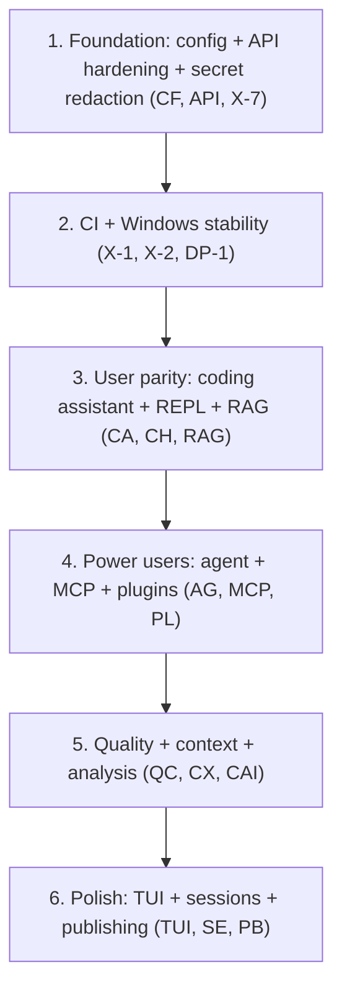

# Beep.AI.Code — Master Enhancement Plan

This is the **product-facing enhancement roadmap** for the CLI, organized by **feature / service**. Phase execution history lives in [MASTER-TODO-TRACKER.md](../MASTER-TODO-TRACKER.md) and `.plans/PHASE_*.md`.

## Baseline

Per the canonical tracker, **phases PH-1 through PH-19 are all complete** (tools, agent loop, API client, context, REPL, memory/rules, plugins/MCP, tests, LangGraph runtime, provider packs, product parity, packaging, coding-agent parity, portable bundles, publishing channels, and Semble search). The items below are therefore **net-new enhancements beyond a shipped, hardened baseline** — not unfinished phase work.

**Priority legend:** P0 critical · P1 high · P2 medium · P3 nice-to-have

---

## Top plans (do these first)

Beep.AI.Code is a terminal **coding agent** in the class of **Claude Code** and **OpenCode**. The highest-leverage initiatives close parity gaps and turn the existing skills/MCP/provider substrate into a discoverable, governed ecosystem.

| Rank | Initiative | Plan | Lead items |
|------|------------|------|------------|
| 0 | **Beep.AI.Server integration parity** — fix confirmed API drift (`ai_middleware`→`v1`), capability discovery, coding-session-via-chat. Default backend must work first. | [features/server-integration.md](features/server-integration.md) | SRV-1, SRV-2, SRV-3 |
| 1 | **Built-in integrations catalog** (skills + MCP + tools) — one-command install of well-known packages (e.g. `open-design`, `graphify`) | [features/integrations-catalog.md](features/integrations-catalog.md) | INT-1, INT-2, INT-8 |
| 2 | **Coding-agent parity** (plan/build toggle, `@mention` subagents, persistent server, parallel worktrees) | [features/coding-agent-parity.md](features/coding-agent-parity.md) | CAP-1, CAP-2, CAP-3, CAP-4 |
| 3 | **Greenfield essentials** (web search, git command family, `beep init`) | [features/new-features.md](features/new-features.md) | NF-1, NF-2, NF-3 |
| 4 | **CI + secret redaction foundation** | this file (cross-cutting) | X-1, X-2, X-7 |

These supersede the incremental per-area backlogs when sequencing the next milestone.

**Maturity:**
- **Mature** — core capability shipped and hardened across one or more completed phases; backlog is incremental.
- **Active** — works today but has known gaps or a high-value expansion surface; backlog is more substantial.

(Feature files use `Shipped` ≈ Mature and `Partial` ≈ Active.)

---

## Summary by area

| Area | Maturity | Lead priority | Feature plan |
|------|----------|---------------|----------------|
| Beep.AI.Server integration | Active | **P0 (SRV-1, SRV-2, SRV-3)** | [features/server-integration.md](features/server-integration.md) |
| API client | Active | P1 (API-2, API-4) | [features/api-client.md](features/api-client.md) |
| Coding Assistant bridge | Active | P1 (CA-1) | [features/coding-assistant.md](features/coding-assistant.md) |
| Chat REPL | Mature | P1 (CH-6) | [features/chat-repl.md](features/chat-repl.md) |
| Agent runtime | Active | P1 (AG-3, AG-4) | [features/agent-runtime.md](features/agent-runtime.md) |
| Workspace & editing | Mature | P1 (WS-2, WS-5) | [features/workspace-editing.md](features/workspace-editing.md) |
| Context & intelligence | Active | P1 (CX-2) | [features/context-and-intelligence.md](features/context-and-intelligence.md) |
| Memory, rules, skills | Mature | P1 (MR-5) | [features/memory-rules-skills.md](features/memory-rules-skills.md) |
| Plugins | Mature | P2 (PL-1) | [features/plugins.md](features/plugins.md) |
| MCP bridge | Mature | P1 (MCP-1, MCP-5) | [features/mcp-bridge.md](features/mcp-bridge.md) |
| Templates | Mature | P2 (TP-1) | [features/templates.md](features/templates.md) |
| Sessions | Mature | P2 (SE-2) | [features/sessions.md](features/sessions.md) |
| RAG | Active | P1 (RAG-2) | [features/rag.md](features/rag.md) |
| Code analysis & indexing | Active | P1 (CAI-1) | [features/code-analysis-indexing.md](features/code-analysis-indexing.md) |
| Quality commands | Active | P1 (QC-1, QC-5) | [features/quality-commands.md](features/quality-commands.md) |
| Permissions, sandbox, hooks | Mature | P1 (PS-1, PS-3, PS-5) | [features/permissions-sandbox-hooks.md](features/permissions-sandbox-hooks.md) |
| Watcher, tasks, bookmarks | Mature | P2 (WT-2) | [features/watcher-tasks-bookmarks.md](features/watcher-tasks-bookmarks.md) |
| TUI | Active | P1 (TUI-1, TUI-4) | [features/tui.md](features/tui.md) |
| Publishing & bundles | Mature | P1 (PB-2) | [features/publishing-and-bundles.md](features/publishing-and-bundles.md) |
| Diagnostics & updates | Active | P1 (DP-1) | [features/diagnostics-packaging-updates.md](features/diagnostics-packaging-updates.md) |
| Configuration & setup | Mature | P1 (CF-4, CF-5) | [features/configuration-setup.md](features/configuration-setup.md) |

Each feature file uses a **unique ID prefix** so items are referenceable across docs and commits:
`API`, `CA` (coding assistant), `CH`, `AG`, `WS`, `CX`, `MR`, `PL`, `MCP`, `TP`, `SE`, `RAG`, `CAI` (code analysis), `QC`, `PS`, `WT`, `TUI`, `PB`, `DP`, `CF`, `NF` (new features), `CAP` (coding-agent parity), `INT` (integrations catalog), `SRV` (server integration), `X` (cross-cutting).

---

## New features (greenfield)

The summary table above tracks **incremental** enhancements to shipped areas. Genuinely **new capabilities** — web search (the `websearch` package is currently an empty stub), a first-class git/commit/PR command family, `beep init`, `beep explain`, `beep serve`, usage analytics, scheduled runs, notebook support, and more — live in a dedicated plan:

- **[features/new-features.md](features/new-features.md)** — tiered `NF-*` proposals with rationale, new surface, dependencies, and verification.

Recommended first three: **NF-1** web search, **NF-2** git command family, **NF-3** `beep init` onboarding.

---

## Cross-cutting themes (all features)

| ID | Theme | Priority | Notes |
|----|-------|----------|-------|
| X-1 | Windows CI parity | P1 | Local `pytest` shows `PermissionError` failures on Windows tmp paths; add CI matrix + Windows job or a documented skip policy |
| X-2 | Official GitHub Actions workflow in repo | P1 | README has a snippet only; add `.github/workflows/beep-ai-code-ci.yml` (ties to DP-1) |
| X-3 | Multi-agent orchestration | P2 | Subagents/dispatch exist; coordinated workers + shared blackboard not unified (ties to AG-1, AG-2) |
| X-4 | Server skills pack sync | P3 | Local skills only until a stable token-auth server endpoint exists (ties to MR-1) |
| X-5 | PyPI release channel | P2 | Phase 14/18 packaging complete locally; publish `beep-ai-code` when ready (ties to X-2) |
| X-6 | Docs ↔ `beep --help` drift test | P2 | Snapshot/grep test asserting every documented command is registered in `cli_command_registration.py` |
| X-7 | Secret redaction everywhere | P1 | Mask token in `beep config`, debug logs, and diagnostics (ties to CF-5, API-2) |

---

## Suggested sequencing

Foundation first, then user-visible parity, then power-user surfaces, then polish.

---

## How to use these plans

1. Pick a feature plan under [`docs/features/`](features/README.md).
2. Implement items top-down by priority within that file; reference items by their unique ID (e.g. `CAI-1`) in branches and commits.
3. If an item maps to a tracker phase, add/flip the row in [MASTER-TODO-TRACKER.md](../MASTER-TODO-TRACKER.md).
4. When a slice ships, update the feature file **Status** line and strike the backlog row.

---

*Generated from a repository scan; revised to reflect completed phases PH-1..PH-19. Align with [ARCHITECTURE.md](../ARCHITECTURE.md) and [SERVICES_REGISTRY.md](SERVICES_REGISTRY.md).*
